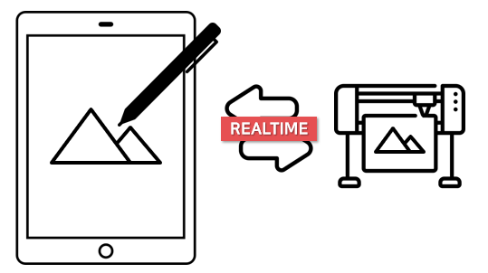
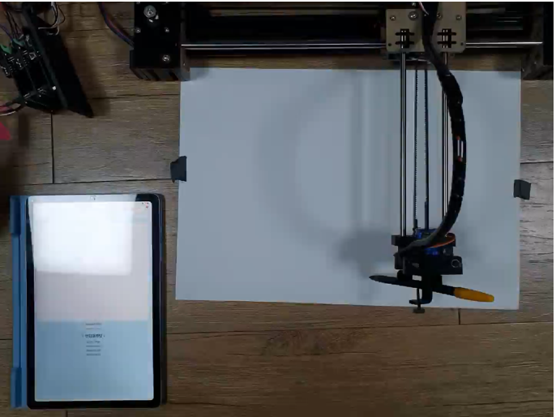
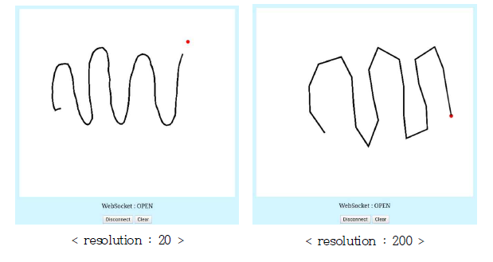

## 디지로그

> 디지털(digital)과 아날로그(analog)의 합성어
디지털을 기반으로 하여 아날로그 적 요소를 결합시킨 기술
> 

### 사용환경
- PHP를 실행하기 위해 [PHPoC 디버거](https://ko.phpoc.com/download.php#download_tools)를 설치하며 테스트
- 제가 사용하는 보드를 참고하여 [라이브러리 다운](https://ko.phpoc.com/download.php#libraries) 후 php 파일의 lib 경로를 변경하여 사용

### 디지로그 프린터

- 자체 제작한 캔버스 웹을 활용하여 HW와 `실시간` 통신
- 캔버스에 그리게 되면 XY플로터에 장착한 모터를 통해 `동일`하게 그려짐
- 사람이 할 수 없는 환경에서 유용하게 쓰일 수 있음

### 📚 사용 스택

**FrontEnd** :

- HTML5/CSS3
- Javascript

**BackEnd** : 

- PHP

**Board** : 

- P4S-342 : PHPoC 보드
- PES-2405[S] 2EA : 스텝모터 제어보드

**Sensor :** 

- 서보 모터 1EA
- 스텝 모터 2EA

**시스템 아키텍처**

### 📋 수행한 역할

수행한 역할 : **팀장 및 총괄**(`데이터 전송`, `모터 제어`, `HW 제작`)

프로젝트에서 `60%` 정도의 기능 구현을 하였습니다.

- XY 플로터 기능을 할 수 있도록 모터들을 부착
- 데이터시트를 참고하여 모터 제어보드와 모터 연결 후 테스트
- 웹에서 구현한 캔버스에 입력을 가하면, JavaScript를 활용하여 좌표 데이터를 무선으로 칩에 전송
- 좌표 데이터를 통해 모터의 회전량을 조절하기 위한 계산식 대입
- HW와 연결하다 보니 물리적 한계를 직접 테스트하며 디버깅 작업

### 🎡 기능 소개

- 태블릿에 글 혹은 그림을 그리면 프린터가 실시간으로 동일하게 그려줌

### 🚀 배운점 & 보완점

**배운점**

1. PHP언어를 사용해 보았음
2. HTML5/CSS3을 활용하여 웹페이지를 구현해봄
3. JS를 통해 웹과 칩과 데이터 교환하는 방법을 깨달음
4. 웹소켓을 이해하고 어떻게 활용할 수 있을지 생각해봄
5. 모터를 활용하기 위해 다양한 파라미터가 필요함을 깨달음

**보완점**

1. 칩 성능 때문에 과도한 연산에 무리가 있던 저희 조는 데이터 전송 속도를 조절하였습니다. 전송 속도를 줄이면 해상도가 낮아져, 세밀하게 표현하고 싶은 부분을 표현하지 못하게 됩니다. 따라서, 칩의 성능을 높히고, 고가 HW를 통해 저희 프로젝트 예술품 조각 및 CNC를 활용한 제품 생산과 같은 곳에 쓰일 수 있다고 생각합니다.

- 해상도가 작으니 표현 할 수 있는 곡선이 더욱 유연해집니다.